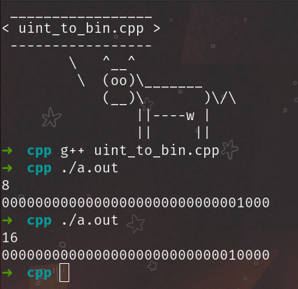
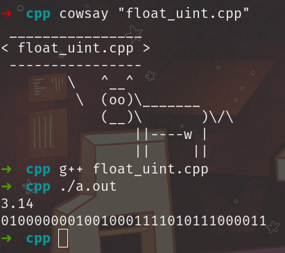
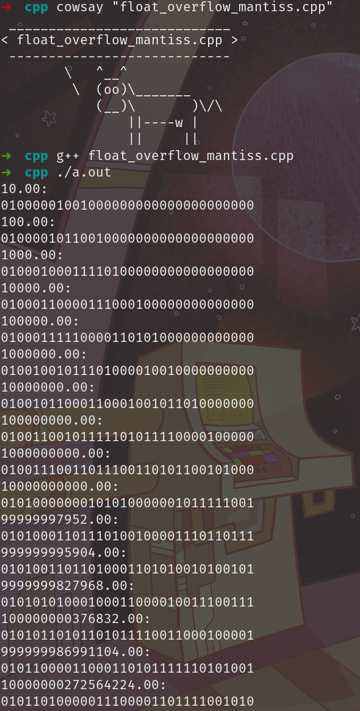
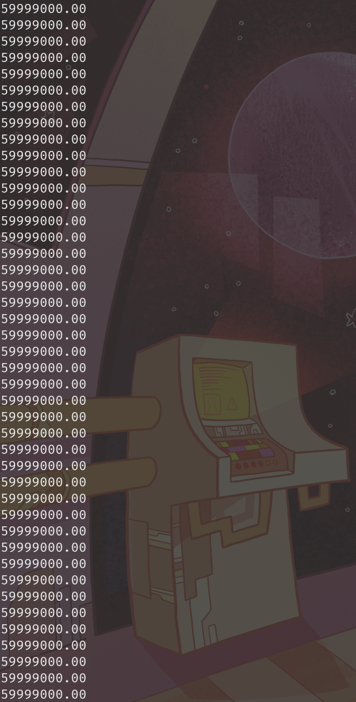

### 0. unsigned int -> binary
```C++
#include <iostream>

void uint_to_bin(unsigned int n) {
  const int BIT_IN_BYTE = 8;
  for (int i = BIT_IN_BYTE * sizeof(unsigned int) - 1; i >= 0; i--){
    unsigned int digit = ((n & (1 << i)) >> i);
    std::cout << digit;
  }
  std::cout << std::endl;
}

int main() {
  unsigned int n;
  std::cin >> n;
  uint_to_bin(n);
}
```


### 1. float -> binary

```C++
#include <iostream>

void uint_to_bin(unsigned int n) {
  const int BIT_IN_BYTE = 8;
  for (int i = BIT_IN_BYTE * sizeof(unsigned int) - 1; i >= 0; i--){
    unsigned int digit = ((n & (1 << i)) >> i);
    std::cout << digit;
  }
  std::cout << std::endl;
}

union fu {
  float f;
  unsigned int ui;
};

int main() {
  fu too;
  std::cin >> too.f;
  uint_to_bin(too.ui);
}
```



### 2. Переплонение мантиссы

```C++
#include <iostream>

void uint_to_bin(unsigned int n) {
  const int BIT_IN_BYTE = 8;
  for (int i = BIT_IN_BYTE * sizeof(unsigned int) - 1; i >= 0; i--){
    unsigned int digit = ((n & (1 << i)) >> i);
    std::cout << digit;
  }
  std::cout << std::endl;
}

union fu {
  float f;
  unsigned int ui;
};

int main() {
  std::cout << std::fixed;
  std::cout.precision(2);

  fu too;
  for (float i = 10.0; i < 1e20; i *= 10.0) {
    too.f = i;
    std::cout << i << ':' << '\n';
    uint_to_bin(too.ui);
  }
}

```



### 3. Бесконечный цикл
```C++
#include <iostream>

int main() {
  std::cout << std::fixed;
  std::cout.precision(2);

  for (float i = 6e7 - 1e3; i < 6.e7 + 1e3; i += 1.) {
    std::cout << i << '\n';
  }
}
```

