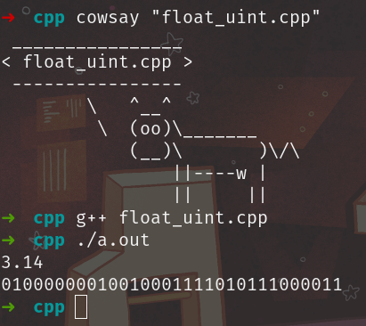

### 0. unsigned int -> binary
С помощью побитовых операций (побитового сдвига и побитового И) получим бинарное представление числа:
```C++
#include <iostream>

void uint_to_bin(unsigned int n) {
  const int BIT_IN_BYTE = 8;
  for (int i = BIT_IN_BYTE * sizeof(unsigned int) - 1; i >= 0; i--){
    unsigned int digit = ((n & (1 << i)) >> i);
    std::cout << digit;
  }
  std::cout << std::endl;
}

int main() {
  unsigned int n;
  std::cin >> n;
  uint_to_bin(n);
}

```


### 1. float -> binary

С помощью union для int и float, а также функции, написанной в предыдущем пункте, получим бинарное представление float:

```C++
#include <iostream>

void uint_to_bin(unsigned int n) {
  const int BIT_IN_BYTE = 8;
  for (int i = BIT_IN_BYTE * sizeof(unsigned int) - 1; i >= 0; i--){
    unsigned int digit = ((n & (1 << i)) >> i);
    std::cout << digit;
  }
  std::cout << std::endl;
}

union fu {
  float f;
  unsigned int ui;
};

int main() {
  fu too;
  std::cin >> too.f;
  uint_to_bin(too.ui);
}
```



### 2. Переплонение мантиссы
После того, как двоичное представление мантиссы перестало влезать в отведенное ей место, её хвост начал обрезаться и получалось число близкое, не не равное нужному, в следствие чего при дальнейших расчетах набегала погрешность.

```C++
#include <iostream>

void uint_to_bin(unsigned int n) {
  const int BIT_IN_BYTE = 8;
  for (int i = BIT_IN_BYTE * sizeof(unsigned int) - 1; i >= 0; i--){
    unsigned int digit = ((n & (1 << i)) >> i);
    std::cout << digit;
  }
  std::cout << std::endl;
}

union fu {
  float f;
  unsigned int ui;
};

int main() {
  std::cout << std::fixed;
  std::cout.precision(2);

  fu too;
  for (float i = 10.0; i < 1e20; i *= 10.0) {
    too.f = i;
    std::cout << i << ':' << '\n';
    uint_to_bin(too.ui);
  }
}

```


### 3. Бесконечный цикл
Из-за дискретности и неравномерности диапазона
значений float возникает бесконечный цикл, в котором при увеличении счетчика на единицу его фактическое значение не изменяется.

```C++
#include <iostream>

int main() {
  std::cout << std::fixed;
  std::cout.precision(2);

  for (float i = 6e7 - 1e3; i < 6.e7 + 1e3; i += 1.) {
    std::cout << i << '\n';
  }
}
```


### 4. Грфик pi

Формула Валлиса:


Формула Лейбница:


Модифицированный ряд обратных квадратов:


Ряд с использованием показательной зависимости:


```C++
#include <iostream>
#include <fstream>
#include <cmath>
using namespace std;

int main() {
  ofstream f_vallis("data_vallis.csv", ios::out);
  ofstream f_leib("data_leib.csv", ios::out);
  ofstream f_sq_1("data_sq_1.csv", ios::out);
  ofstream f_sq_2("data_sq_2.csv", ios::out);
  int counter = 1;auto start = clock();
  for (long long int n = 1; n <= 1e6; n++){
    double pi_vallis = 1.0;
    float pi_leib = 0.0;
    float pi_sq_1 = 0.0;
    float pi_sq_2 = 0.0;
    float one = 1.0;
    for (int i = 1; i <= n; i++) {
      pi_vallis *= ((4.0 * i * i) / (4.0 * i * i - 1.0));
      pi_leib += one / (2 * (i - 1) + 1);
      pi_sq_1 += one / (i * i);
      pi_sq_2 += one / (pow(3, i -1) * (2 * (i - 1) + 1));
      one *= -1.0;
    }
    f_leib << n << ' ' <<  4 * pi_leib << '\n';
    f_vallis << n << ' ' <<  2 * pi_vallis << '\n';
    f_sq_1 << n << ' ' <<  sqrt(12 * pi_sq_1) << '\n';
    f_sq_2 << n << ' ' <<  2 * sqrt(3) * pi_sq_2 << '\n';
  }
}
```

```python
import matplotlib.pyplot as plt
import numpy as np
n = []
pi_vallis = []
with open('time_vallis.csv', 'r') as file:
  for line in file.readlines():
    split = line.split(' ')
    n.append(int(split[0]))
    pi_vallis.append(float(split[1]))
len = 200
pi_pi = [np.pi] * len
plt.plot(n[0:len], pi_vallis[0:len], label = r'vallis')
plt.legend()
plt.xlabel(r'n')
plt.ylabel(r'pi')
plt.plot(n, t_vallis)
plt.show()
```

### 5. Время pi

Поскольку порядок временных значений сильно различается, то помимо одного графика, сделаем два дополнительных, где сравним формулы с похожей асимптотикой:


Все:


Валлис + Лейбниц:


Обратные квадраты + показательная зависимость:


```C++
#include <iostream>
#include <fstream>
#include <cmath>
#include <ctime>
using namespace std;

int main() {
  double pi = 3.1415926535;
  ofstream f_vallis("time_vallis.csv", ios::out);
  int counter = 1;
  auto start = clock();
  for (long long int n = 1; n <= 1e6; n++){
    double pi_vallis = 1.0;
    for (int i = 1; i <= n; i++) {
      pi_vallis *= ((4.0 * i * i) / (4.0 * i * i - 1.0));
    }
    auto now = clock();
    if (floor(2 * sqrt(3) * pi_sq_2 * pow(10, counter)) == floor(pi * pow(10, counter))) {
      f_vallis << counter << ' ' << now - start << '\n';
      counter += 1;
    }
    if (counter == 10)
      break;
  }
}
```

```python
import matplotlib.pyplot as plt
import numpy as np
n1, n2, n3, n4 = [], [], [], []
t_vallis, t_leib, t_sq_1, t_sq_2 = [], [], [], []
with open('time_vallis.csv', 'r') as file:
  for line in file.readlines():
    split = line.split(' ')
    n1.append(int(split[0]))
    t_vallis.append(float(split[1]))
with open('time_leib.csv', 'r') as file:
  for line in file.readlines():
    split = line.split(' ')
    n2.append(int(split[0]))
    t_leib.append(float(split[1]))
with open('time_sq_1.csv', 'r') as file:
  for line in file.readlines():
    split = line.split(' ')
    n3.append(int(split[0]))
    t_sq_1.append(float(split[1]))
with open('time_sq_2.csv', 'r') as file:
  for line in file.readlines():
    split = line.split(' ')
    n4.append(int(split[0]))
    t_sq_2.append(float(split[1]))
plt.scatter(n1[0:5], t_vallis[0:5], s = 15, label = 'vallis')
plt.scatter(n2[0:5], t_leib[0:5], marker = '+', s = 15, label = 'leib')
plt.scatter(n3[0:5], t_sq_1[0:5], marker = 's', s = 15, label = 'inverse squares')
plt.scatter(n4[0:5], t_sq_2[0:5], marker = '^', s = 15, label = 'power series')
plt.xlabel('номер знака после запятой')
plt.ylabel('время достижения, у.е.')
plt.legend()
plt.show()
```
